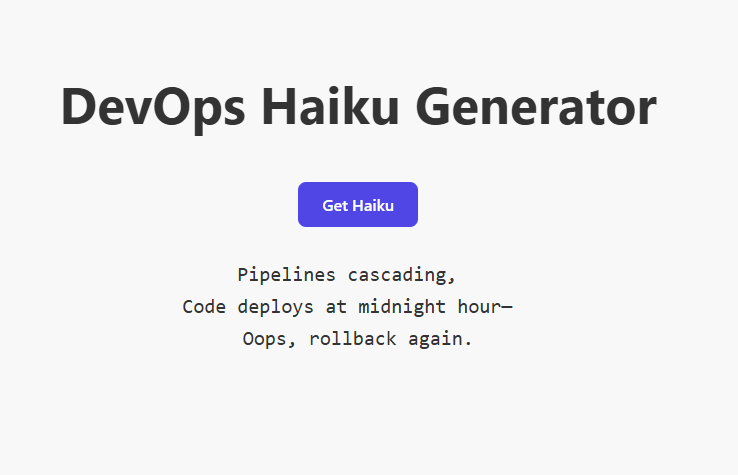

# 🌸 Haikube

> A Kubernetes-themed haiku generator with DevOps soul and AI magic.

Haikube is a full-stack project that combines a Go backend with a React frontend to deliver hilarious, poetic, and occasionally insightful DevOps haikus. Powered by OpenAI, deployed anywhere, and easy to extend — it's both art and infrastructure.

---

## 🚀 Features

- 🤖 AI-generated haikus using OpenAI GPT-4o
- ⚙️ Go backend API with proper testing, linting, and CI
- 🌐 Modern React frontend (Vite) with responsive design
- ✅ Clean CORS handling, secure secret management
- 💬 Integration-ready REST API (`GET /haiku`)

---

## 📸 Preview



---

## 📦 Tech Stack

| Layer    | Tech              |
|----------|-------------------|
| Backend  | Go (Golang)       |
| API      | OpenAI GPT-4o     |
| Frontend | React + Vite      |
| Testing  | Go test + mocks   |
| CI/CD    | GitHub Actions    |
| Secrets  | Env vars / GitHub secrets |

---

## 🧑‍💻 Local Development

### Prerequisites

- Go 1.21+
- Node.js 18+
- OpenAI API key

### 1. Clone the repo

```bash
git clone https://github.com/your-username/haikube.git
cd haikube
```

### 2. backend setup

```bash
cd backend
export OPENAI_API_KEY=your-api-key
go run main.go
``` 

### 3. Frontend setup

```bash
cd frontend
npm install
npm run dev

```

Open http://localhost:5173

## 🧪 Testing

```bash
cd backend
go test -v ./...
```

Includes:

- ✅ Unit tests for GenerateHaiku()
- ✅ Integration tests for GET /haiku using mocked responses

## 🌐 API
GET /haiku

Returns:

{
  "text": "Pods drift through the cloud,\nYAML spells whispered at dusk,\nOps prays to the logs."
}

## 🔒 Secrets
This app uses the OPENAI_API_KEY environment variable.

In dev: export it manually or use a .env file

In CI: store it securely in GitHub → Settings → Secrets → OPENAI_API_KEY

## 📦 Production Deployment Ideas
✅ Docker (coming soon)

🚀 Deploy Go backend to Google Kubernetes Engine

## 🧠 Inspiration
Haikube is inspired by the beautiful chaos of Kubernetes and the occasional spiritual enlightenment that comes from debugging YAML at 3AM.

## 🤝 Contributing
Pull requests are welcome! Feel free to:

Add new themes (e.g. cyberpunk, pirate ops)

Improve the UI

Extend the API

## 📜 License
MIT